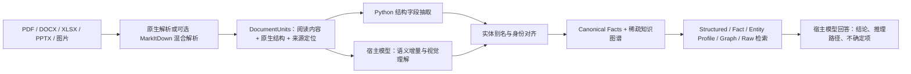

# Evidence KG + Lean GraphRAG

将 PDF、Word、Excel、PPT 和图片企业材料转为可追溯的事实库与知识图谱，结合结构化检索、事实检索、实体档案、图路径和原始文档完成跨格式问答。

本仓库整理自最新 `evidence-kg-builder` **4.0.0**，面向比赛 MVP 展示与本地复现。默认保留已经验证的原生解析；新增独立、可选的 MarkItDown 阅读视图入口。抽取、对齐、建图、检索及回答逻辑沿用最新版。

> **比赛运行方式：Teleagent 原生大模型调用 Skill。当前尚未在 Teleagent 上测试。** 本仓库中的真实模型验证来自本地 OpenRouter 调试流程，不能视为 Teleagent 的集成验收结果。

## 1. 项目如何工作



几个关键设计：

- **结构字段由 Python 处理。** Excel 原始值、公式、隐藏列、批注和合并区域进入结构台账；模型处理备注、原因、风险和视觉关系等语义增量。
- **事实库优先，图谱按需使用。** 数值、日期和状态保留为 Fact；稳定实体和需要遍历的对象建节点。图路径是检索通道之一。
- **跨格式别名进入 Entity Profile。** 名称映射类问题可以直接使用实体档案与来源检索，多跳问题才扩展图路径。
- **证据自动继承来源定位。** 回答可引用 PDF 页码、Word 章节、Excel Sheet/行/单元格和 PPT Slide；不为 Word 人为推测页码。
- **文件检查点便于观察与恢复。** 模型只输出最小 JSON；Python 接收任务结果并维护指纹、实体映射和结构完整性。
- **轻量运行。** 无需本地 embedding、向量数据库、Neo4j、GNN 或 OCR。图片保留给宿主多模态模型理解。

## 2. 仓库内容

```text
.
├── README.md
├── .env.example
├── requirements-notebook.txt
├── evidence_kg_openrouter_debug.ipynb  # 本地逐阶段 API 调试
├── interactive_kg.py                 # 最新 Notebook 的原生交互问答入口
├── skill/evidence-kg-builder/
│   ├── SKILL.md
│   ├── requirements.txt              # 原生路线依赖
│   ├── requirements-markitdown.txt   # 可选阅读视图依赖
│   ├── scripts/
│   ├── references/
│   └── tests/
├── materials/                        # 测试集 A 的六份材料
├── examples/
│   ├── inputs.json                   # 五份 corpus + 一份 questions
│   ├── questions_first3.json          # 从原问题集读取的 Q1、Q2、Q3
│   ├── prebuilt/work/                 # 原生路线的可直接检索知识库
│   └── results/                      # 两条路线的前三题回答
├── tests/                            # 交互入口已有回归测试
└── docs/                             # 验证记录和 MVP 发布检查
```

`examples/prebuilt/work` 包含解析单元、事实库、图谱及引用资产，供快速问答；它不包含可继续抽取/对齐的 `state.json`。需要重建或恢复全流程时，使用自己的运行目录。

测试集中的具体实体与问题只放在 `materials`、`examples` 和演示 Notebook 中。生产 Skill 不内置评测答案映射。

### 正式运行依赖与可选工具

正式运行清单是 `skill/evidence-kg-builder/requirements.txt`，仅有 7 项直接依赖：`defusedxml`、`openpyxl`、`python-pptx`、`pdfplumber`、`Pillow`、`requests`、`python-dotenv`。它们分别服务于文档结构解析、图片处理及可选 API 问答。

正式清单及其安装链中没有 `notebook`、`jupyter`、`nbformat`、`jsonschema`、pytest、格式化器或开发工具。PDF/Office 库的必要传递依赖会随 pip 安装。

- `requirements-markitdown.txt`：仅在选择可选解析时安装，包含原运行依赖和指定的 MarkItDown 格式支持。
- `requirements-notebook.txt`：仅供本地调试 Notebook，另加 pandas、JupyterLab 和 ipywidgets；其中 nbformat/jsonschema 等由 Jupyter 工具链传递引入。它不是正式运行必装清单。
- 回归测试使用 Python 自带 `unittest`，没有单独安装测试框架。

## 3. 最短路径：本地配置 API，直接体验前三题

以下命令在 **Windows PowerShell、仓库根目录**执行。推荐 Python 3.11。

### 3.1 建立环境

```powershell
py -3.11 -m venv .venv
$python = ".\.venv\Scripts\python.exe"
& $python -m pip install -r .\skill\evidence-kg-builder\requirements.txt
```

直接使用虚拟环境中的 Python，省去激活脚本设置。

### 3.2 配置 Key 和模型

```powershell
Copy-Item .env.example .env
notepad .env
```

填写：

```dotenv
OPENROUTER_API_KEY=你的实际Key
OPENROUTER_BASE_URL=https://openrouter.ai/api/v1
LLM_MODEL=stealth/space-bunny-alpha
LLM_REASONING_EFFORT=medium
```

`LLM_MODEL` 示例是本次本地验证使用的模型，实际运行时可换成账户可用的模型。服务端模型可用性会变化，示例名称不保证长期有效。完整重建还需要模型支持图像输入。

本地调用使用 Bearer Key 和 `/chat/completions`，无需额外安装模型 SDK；接口设置可参考 [OpenRouter 官方 Quickstart](https://openrouter.ai/docs/quickstart)。`.env` 已被忽略，不会进入 Git。

CLI 参数 `--model` 优先于 `LLM_MODEL`；系统环境变量优先于 `.env`。建议明确填写模型，避免使用代码中的默认值。

### 3.3 先检查无 API 的检索

```powershell
$sampleQuestions = Get-Content .\examples\questions_first3.json -Raw -Encoding UTF8 | ConvertFrom-Json
& $python .\skill\evidence-kg-builder\scripts\lean_graphrag.py --work .\examples\prebuilt\work --question $sampleQuestions[0].question --retrieve-only
```

此步骤不会调用模型，可以先确认知识库和检索能够正常加载。

### 3.4 回答第一题或前三题

```powershell
New-Item -ItemType Directory -Force .\runs\qa | Out-Null
& $python .\skill\evidence-kg-builder\scripts\lean_graphrag.py --work .\examples\prebuilt\work --env-file .env --question $sampleQuestions[0].question --debug-output .\runs\qa\Q1.json
```

循环测试前三题，并保存回答与检索明细：

```powershell
foreach ($sampleQuestion in $sampleQuestions) {
    & $python .\skill\evidence-kg-builder\scripts\lean_graphrag.py --work .\examples\prebuilt\work --env-file .env --question $sampleQuestion.question --debug-output ".\runs\qa\$($sampleQuestion.id).json" |
        Tee-Object -FilePath ".\runs\qa\$($sampleQuestion.id).md"
}
```

这条路径复用示例知识库，只调用最终回答模型；它不重新执行抽取和对齐。已有回答见 [原生路线结果](examples/results/native) 与 [MarkItDown 路线结果](examples/results/markitdown)。

## 4. 从文档开始完整重建：Notebook

现有 Notebook 已经包含实际 API 调用、图片附件、并发批处理、顺序接收结果以及最终问答，适合第一次跑全流程。

```powershell
& $python -m pip install -r .\requirements-notebook.txt
& $python -m jupyterlab .\evidence_kg_openrouter_debug.ipynb
```

从仓库根目录启动，并选择对应虚拟环境的内核。按以下顺序运行：

1. **配置单元格**：默认 `PARSER_BACKEND = 'native'`；设置 `MODEL`、接口地址和并发数。
2. **加载 Skill / 安装依赖**：默认读取仓库中的 `skill` 目录。
3. **检查材料和角色**：确认五份来源为 `corpus`，问题集为 `questions`。
4. **Parse → Prepare**：无需 API，生成可定位单元和结构化抽取计划。
5. **API 初始化**：在 `OpenRouter API Key` 隐藏输入框填写 Key。
6. **Extraction**：预览并发批次、调用模型、接收结果，再运行剩余抽取循环。
7. **Alignment → Build → Validate**：完成实体对齐与建图，并确认工作流完整。
8. **GraphRAG**：查看 query plan、各检索通道、最终 context，再调用回答模型。
9. **批量问答 / 耗时统计**：将 `QUESTIONS` 填为前三题，查看回答与按阶段聚合的调用统计。

Notebook 的配置与 CLI `.env` **分别设置**：Notebook 使用配置单元格中的 `MODEL` 和隐藏 Key 输入，不自动读取 `.env`。不要把真实 Key 写进单元格。

默认 extraction / alignment 并发为 8，QA 并发为 4，reasoning 为 `medium`。遇到服务端限流时可降低并发。抽取默认每批最多 5 个任务、约 14,000 字符；对齐每批最多 8 个任务。

### 4.1 选择 MarkItDown

将配置单元格改为：

```python
PARSER_BACKEND = 'markitdown'
```

重新从配置和依赖单元格开始运行。Notebook 会安装可选依赖，并使用独立入口解析，输出到 `kg_debug_run/work_markitdown`。后续业务流程和问答单元格相同。

### 4.2 最后的交互问答入口

最新 Notebook 末尾的交互入口保留原来的 `interactive_kg.py`。它使用**原生解析**：第一次需要时构图，后续问题复用完整知识库；失败时保留检查点。

运行该入口前保持 `PARSER_BACKEND = 'native'`。MarkItDown 路线使用前面的分步与批量问答单元格；Notebook 会阻止在 MarkItDown 模式下启动原生交互入口，避免混用工作目录。

## 5. 两条解析路线的区别

| 格式 | 默认原生解析 | 可选 MarkItDown 路线 |
| --- | --- | --- |
| DOCX | OOXML 段落、章节、表格及图片 | 保留原生单元，另存完整 Markdown；无原生内容时使用文档级备用视图 |
| XLSX | openpyxl 原始值、缓存值、公式、隐藏信息、批注和合并区域 | 原生单元保持一致，另存辅助 Markdown |
| PPTX | 文本、表格、图表、备注、形状、连接端点与图片 | 按 Slide 使用 Markdown 阅读视图，保留原生结构、备注、图表和资产 |
| PDF | pdfplumber 文本层和表格，必要时渲染图片 | 沿用相同策略 |
| 图片 | 原图交给宿主多模态理解 | 沿用相同策略，无本地 OCR |
| TXT / MD | 原生文本读取 | 沿用相同策略 |

这延续了旧版的混合方式。完整 Markdown 不会被赋予虚构的页码或单元格定位；DOCX/XLSX 的辅助 Markdown 不替换正常下游任务中的精确原生单元。

两路都输出 `00_document_units.json` 与相同的工作状态契约。可选路线的缓存还记录后端、适配器代码指纹及转换依赖版本。转换失败会显示具体文件与错误，不能作为成功解析继续验收。

## 6. 命令行阶段与宿主模型的分工

下面所有命令从仓库根目录执行。先选择其中一条解析命令。

**默认原生路线：**

```powershell
& $python .\skill\evidence-kg-builder\scripts\kg_pipeline.py parse --manifest .\examples\inputs.json --work .\runs\native\work --fresh
```

**可选 MarkItDown 路线：**

```powershell
& $python -m pip install -r .\skill\evidence-kg-builder\requirements-markitdown.txt
& $python .\skill\evidence-kg-builder\scripts\parse_markitdown.py --manifest .\examples\inputs.json --work .\runs\markitdown\work --fresh
```

后续共用同一个 pipeline。以下以原生路线为例：

```powershell
$workDir = ".\runs\native\work"
$pipeline = ".\skill\evidence-kg-builder\scripts\kg_pipeline.py"
& $python $pipeline prepare --work $workDir
& $python $pipeline tasks --stage extract --work $workDir --limit 5 --char-budget 14000 --batch-count 8 --output .\runs\native\extract_batches.json
```

`tasks` **只导出任务，不调用模型**。宿主读取任务和相关图片，按 Skill 契约生成响应；Notebook 已提供此调用过程。每个响应分别保存，并顺序接收：

```powershell
& $python $pipeline accept --stage extract --work $workDir --response .\runs\native\extract_response.json
& $python $pipeline tasks --stage align --work $workDir --limit 8 --batch-count 8 --output .\runs\native\align_batches.json
& $python $pipeline accept --stage align --work $workDir --response .\runs\native\align_response.json
```

上面的 response 路径是宿主生成文件的示例。重复导出、调用、接收，直到抽取待办为零、对齐停止；同一轮对齐使用冻结 snapshot，模型请求可并发，检查点写入顺序执行。

```powershell
& $python $pipeline build --work $workDir
& $python $pipeline validate --work $workDir --require-complete
```

验证现成的示例图谱使用独立 graph 参数：

```powershell
& $python $pipeline validate --graph .\examples\prebuilt\work\04_knowledge_graph.json --require-complete
```

### 检查点与恢复

- 输入、配置、核心代码或相关依赖改变会触发缓存失效。可选解析还检查适配器指纹。
- `parse --fresh` 会重新解析并重置活动状态里的抽取/对齐；日常恢复不要重新执行这一命令。
- 同一工作目录内保存 `state.json` 和阶段产物；重新导出尚未完成的任务即可续跑。
- 不要把一轮/一条解析路线的响应接收到另一条路线。接收器检查 fingerprint、task_id 和 alignment round。
- 两条路线使用不同工作目录，便于并排观察结果。

## 7. 日志怎么看

Notebook 默认运行目录为 `kg_debug_run`；其中原生状态在 `work`，可选状态在 `work_markitdown`。本次发布验证的完整本地日志在 `runs`，已被 Git 忽略。远端保留精选回答与汇总记录。

| 文件或视图 | 查看什么 |
| --- | --- |
| `work/00_document_units.json` | 每个文档的 parse_status / parse_error、单元内容、locator、结构和资产 |
| `work/00_extraction_plan.json` | 哪些任务由规则处理，哪些送模型，是否存在自由文本 overlay |
| `extract_* / align_*` 导出文件 | 任务、batch、fingerprint、pending_count 和对齐 round |
| `model_outputs/*.txt` | 模型原始响应，适合排查 JSON 与语义遗漏 |
| `model_outputs/*accepted.json` | 宿主补入指纹/轮次后提交的响应 |
| `work/01_mentions.json` | 各单元抽出的实体、关系、属性和 unresolved |
| `work/02_entity_map.json` | 别名聚合、候选选择、实体映射、轮次及对齐停止状态 |
| `work/03_canonical_facts.json` | 规范化事实和来源证据 |
| `work/04_knowledge_graph.json` | 图节点、边、事实、诊断和工作流完整性 |
| CLI `--debug-output` 文件 | 实际检索结果、完整 context、最终回答与 usage |
| Notebook 检索单元格 | query plan、Entity Profiles、Structured / Fact hits、Graph Paths 和 Raw Units |
| Notebook 最后统计单元格 | 请求次数、状态、耗时、token 和服务返回的 cost |

例如查看某次问答的检索统计：

```powershell
$qaDebug = Get-Content .\runs\qa\Q1.json -Raw -Encoding UTF8 | ConvertFrom-Json
$qaDebug.query_plan
$qaDebug.stats
$qaDebug.usage
$qaDebug.context
```

定位回答遗漏时，从上游往下看：**原文是否被解析 → 事实是否被抽出 → 同一实体是否对齐 → 相关信息是否进入 context → 模型是否使用它**。别名缺失先看实体映射；事实已有但回答遗漏，再看 Entity Profile、Raw Source 与最终 context。

Notebook 的 `call_logs` 位于内核内存；需要留存时在统计单元格后添加：

```python
pd.DataFrame(call_logs).to_csv(RUN_ROOT / 'call_logs.csv', index=False, encoding='utf-8-sig')
```

按请求相加的耗时包含并发重叠，不能直接当作总墙钟耗时；`usage.cost` 为服务返回值，缺失时不能据此推断免费。

## 8. Teleagent 比赛接入说明

比赛预期由 Teleagent 原生大模型读取 `skill/evidence-kg-builder/SKILL.md`，按阶段加载 references，并调用 Python 脚本完成解析、准备、任务导出、响应接收、建图与检索。

语义抽取、实体歧义选择、图片理解和最终回答由 Teleagent 宿主模型承担。OpenRouter Key 是本地调试路径的配置；宿主原生模型方式无需为了这些阶段另配 OpenRouter Key。

**尚未在 Teleagent 上进行测试。** 当前未验证该平台的 Skill 加载、文件与命令执行、图像读取、并发调度、检查点恢复及最终回答。本仓库不包含已验收的 Teleagent SDK 适配器，也不提供未经验证的平台安装命令。

`agents/openai.yaml` 是随最新版保留的入口元数据，不能作为 Teleagent 兼容性证明。Teleagent 原生集成是 MVP 后续的明确验收项。

## 9. 验证结果与 MVP 状态

验证开始：**2026-10-03**；发布整理：**2026-10-04**。详细命令、环境、调用统计和两路结果见 [VALIDATION.md](docs/VALIDATION.md)；发布取舍见 [MVP_CHECKLIST.md](docs/MVP_CHECKLIST.md)。

- 原生示例知识库：57 个 DocumentUnits，273 个节点、414 条边、1,285 条事实和 506 条证据；完整性校验通过。
- MarkItDown 路线：五份 corpus 成功解析，问题集排除；从抽取、对齐到建图执行完整流程。
- 两条路线均使用本地真实 API 回答原测试集 Q1–Q3，保存回答与运行统计。
- 回归测试覆盖原有端点处理、未知关系类型、交互恢复和新解析路线的结构保留、缓存隔离、错误提示。
- 当前结果是功能与运行验证，未进行全量十题评分或官方准确率验收；模型抽取具有随机性，两路节点/事实数量差异不能单独证明质量高低。
- Teleagent 原生执行：**未测试**。

运行测试：

```powershell
& $python -m unittest discover -s .\skill\evidence-kg-builder\tests -v
& $python -m unittest discover -s .\tests -v
```

未安装 MarkItDown 时，可选路线的转换测试会跳过；缺失依赖的 CLI 错误测试仍会运行。安装可选依赖后可执行全部解析测试。

## 10. 常见运行问题

| 现象 | 检查方法 |
| --- | --- |
| Key 未配置或认证失败 | CLI 检查 `.env` 和 `--env-file`；Notebook 检查隐藏输入；清除错误的系统环境变量覆盖 |
| 模型不可用、无图片能力或限流 | 选择账户可用且符合任务输入的模型，降低并发；不要改变原始文档事实 |
| `Scripts changed` | 核心代码与检查点不匹配，需要在新工作目录重建 |
| MarkItDown 缺失依赖 | 安装 Skill 的 `requirements-markitdown.txt`；默认原生路线不受影响 |
| 个别文档解析失败 | 查看 parse 返回的文件错误与 `00_document_units.json`，不要将部分输出当作完整成功 |
| build 提示任务未完成 | 检查 pending extraction 与 alignment stopped，继续导出并处理剩余任务 |
| Notebook 找不到材料或 Skill | 从仓库根目录启动，检查配置单元格路径与 Python 内核 |
| 图谱已有内容但答案不完整 | 逐层检查事实、实体档案、检索命中和完整 context |

此发布保留了最新 Skill 的行为边界，新增内容集中在可选解析、复现材料和说明文档。
